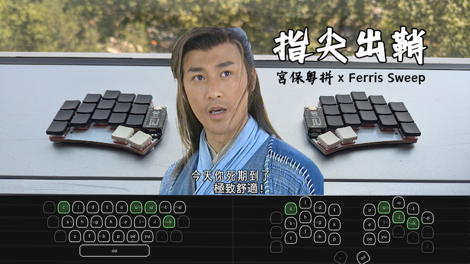
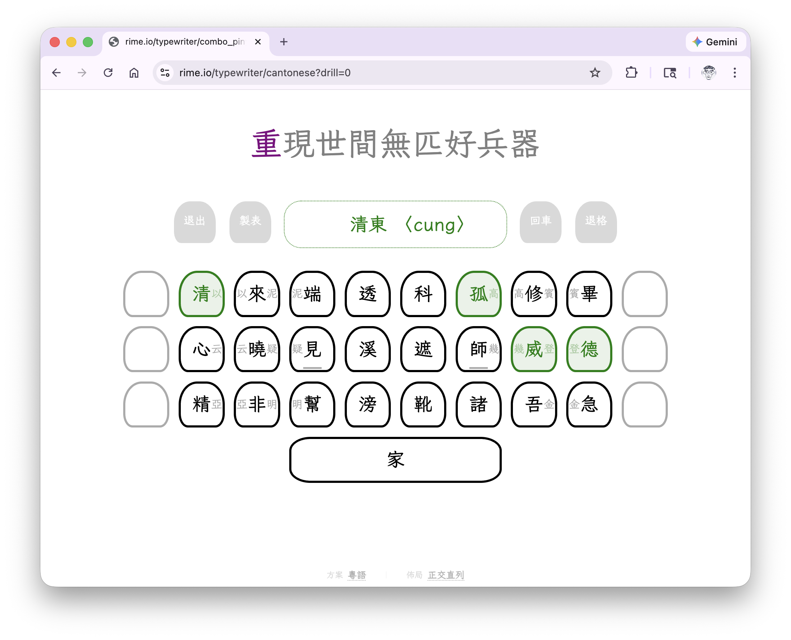
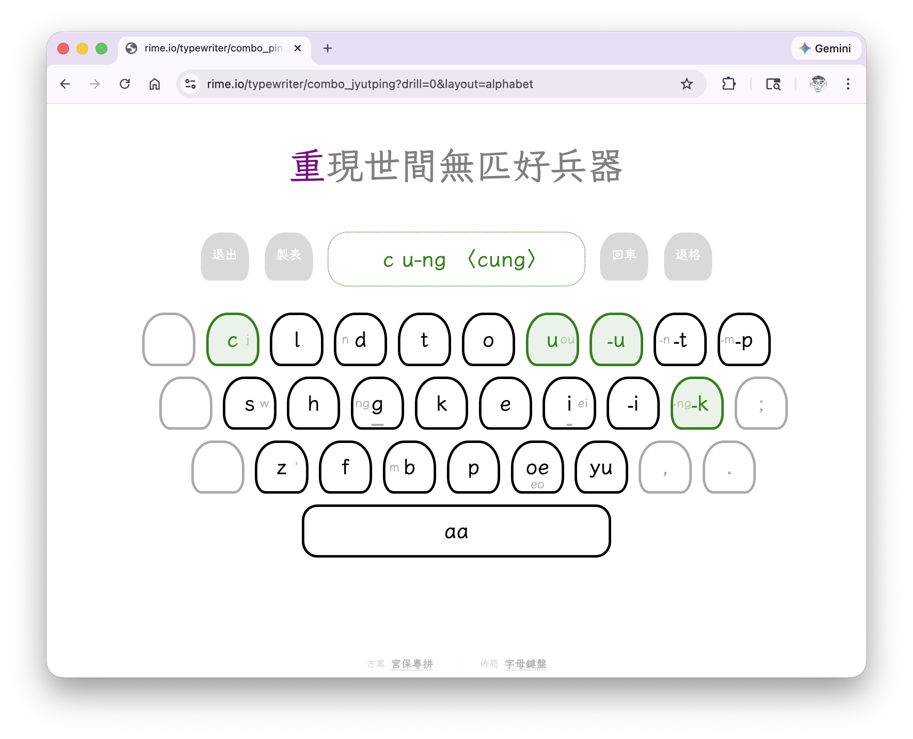
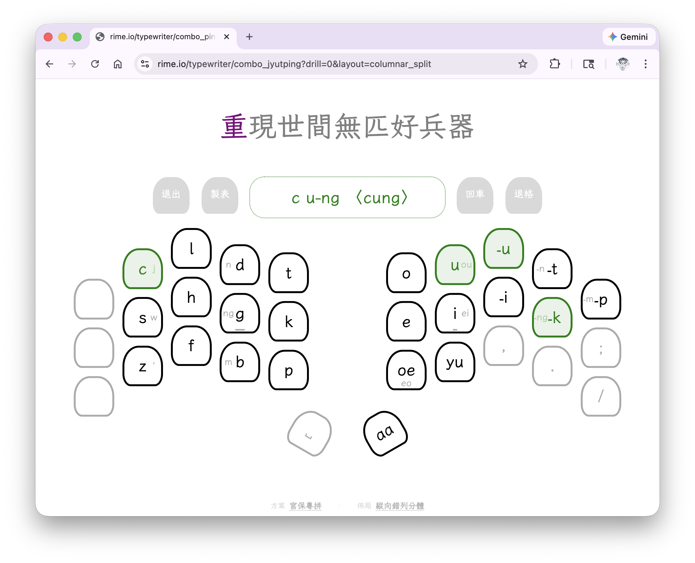
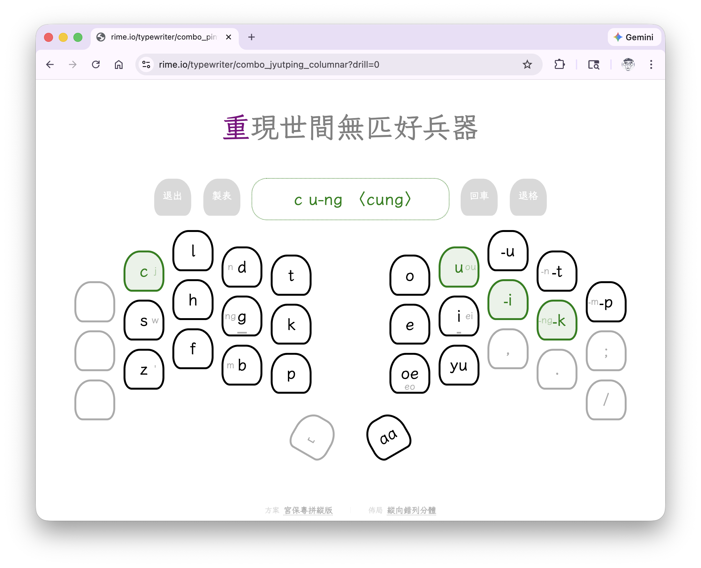
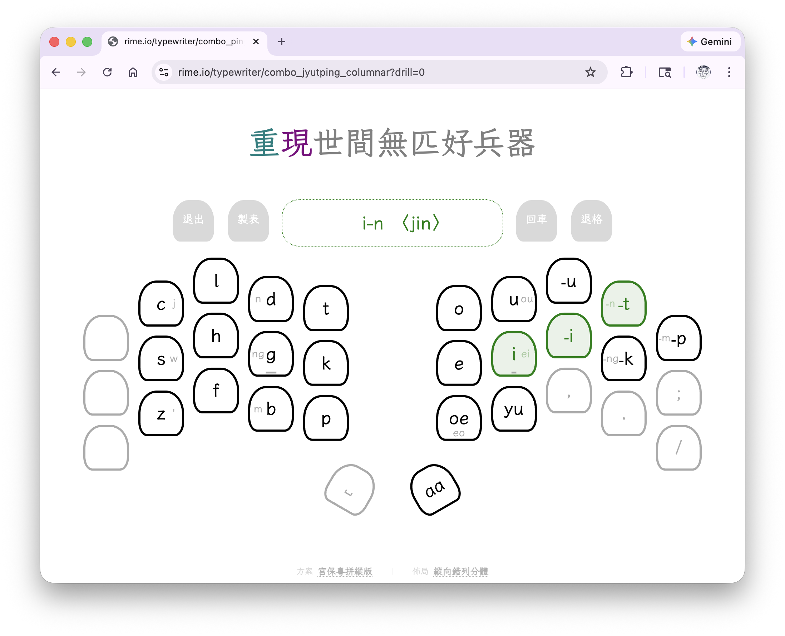

+++
title = "爲極簡分體鍵盤寫了個「動態適配指法」的粵拼並擊輸入法"
date = "2026-02-25"
[taxonomies]
tags = ["客製化鍵盤", "人體工學鍵盤", "方案", "宮保粵拼", "並擊輸入", "拼寫運算", "前端開發", "Rust", "開發實錄", "視頻"]
+++

大家好，今天來分享一個最近折騰的開源業餘專案：宮保粵拼 × Ferris Sweep 軟硬體協同優化。

如果你曾經嘗試過「並擊（Chording）」輸入法，你一定會發現一個痛點：\
標準鍵盤的斜向錯列（Row-staggered）簡直是並擊的噩夢。\
當你需要同時按下跨排的三個鍵時，手指的扭曲與肌肉牽扯不僅容易疲勞，還會嚴重拖慢效率。

爲了解決這個物理極限，我做了兩件事：

一、底層引擎（R²ime 微觀引擎）：

基於 Rime 靈活的拼寫運算，開發了「宮保粵拼」。\
它允許指法的泛化（例如不綁死絕對鍵位，而是基於相對位置並擊出 ⟨-ng⟩、⟨-m⟩ 等複雜韻尾）。

二、視覺導航與動態優化（Typewriter）：

寫了一個 Web 端的可視化模擬器。\
它不僅用 CSS 完美復刻了 Ferris Sweep 的激進縱向錯列（Columnar Stagger）與拇指旋轉角度，\
更核心的是，它會根據你當前的物理佈局，動態計算並提示最符合人體工學的「最佳並擊和弦」。

舉個例子：

<!-- more -->

粵拼 ⟨ung⟩ 的並擊和弦原本是如下形狀。

做這個手勢，要右手食指夠位於上排的 `孤` 鍵（表示元音 ⟨u⟩），中指、無名指並擊中排的 `威` `德` 兩鍵（表示韻尾 ⟨-ng⟩），十分費力。

在標準鍵盤上，演算法會將指法優化調整爲 `u-u-k`；

切換到 Sweep 佈局，這項調整導致中指（`-u` 鍵）與無名指（`-k` 鍵）跨度極大，成爲一項「負優化」；

因此算法根據按鍵的空間排列和並擊手勢的便利性，將提示優化爲直線型的和弦 `u-i-k`。

再舉一例，輸入粵拼 ⟨in⟩：

在標準鍵盤上，演算法會妥協提示 `i-u-t`；

但當你切換到 Sweep 佈局，系統會自動將提示優化爲接近完美直線的 `i-i-t`，徹底消滅手指的無效彎曲。

把冗長的粵拼音節壓縮成一次空間上的和弦，讓輸入法演算法主動去適應硬體的物理佈局。\
重現世間無匹好兵器，歡迎大家來看看實測影片或親自上手體驗！

📺 開發實錄與打字實測影片：
[B 站](https://www.bilibili.com/video/BV1HGfrBaEtp/) | [YouTube](https://youtu.be/jjzALE5EHZk)

💻 在線打字體驗（Typewriter）：<https://rime.io/typewriter/combo_jyutping>

📦 Rime 配方倉庫：<https://github.com/lotem/rime-combo-jyutping>

歡迎各位鍵盤玩家與 Rime 大佬交流指教！
