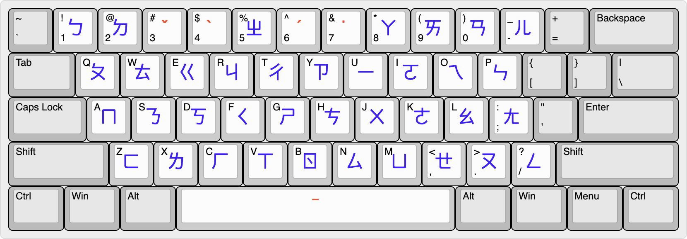
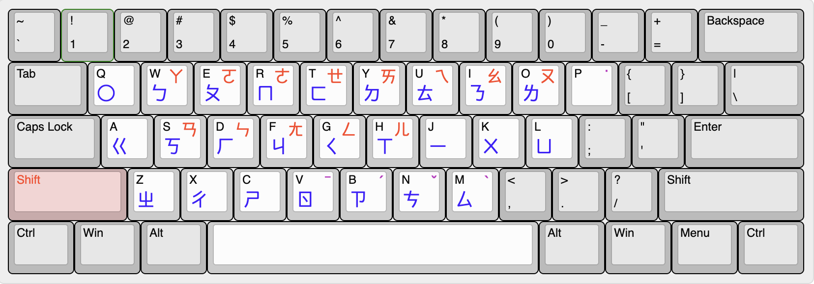

---
aliases:
- blog/2026/01/27/dongfengpo-zhuyinyuan/
date: 2026-01-27 22:00:00
tags:
- 音樂
- 注音
- Rime
- 輸入法
title: 東風破·注音緣：記一段 Rime 輸入法的神級往事
---
十餘年前，BYVoid 在部落格中記述了與 Rime 作者佛振的一面之緣，震驚於其「手寫注音」的神技。
這份「緣、驚、愧」成了 Rime 發展史上一段佳話。

## 創作背景：緣·驚·愧

典出 BYVoid 名篇《[推薦一個神級輸入法——Rime][1]》。

隨著最近 Rime 新版**注音輸入方案**開發完成，我不禁回想到那個開源輸入法初創的純粹年代。

我用鍵盤彈奏這曲〈[東風破][2]〉，原是爲[蘭茂][3]《[早梅詩][4]》所寫。
如今，我以 BYVoid 的第一人稱視角重新填詞，重現當年那場大會上的驚鴻一瞥。

### 作品展示

<figure>
  
<figcaption>〈東風破·注音緣〉音軌試聽</figcaption>

  
<audio controls src="東風破.mp3"></audio>

</figure>

<!-- more -->

<figure>
  
<figcaption>〈東風破〉鋼琴版</figcaption>

  
<audio controls src="東風破-鋼琴.mp3"></audio>

</figure>

**觀看影片：** [B站][5] · [YouTube][6]

影片伴隨著音樂節奏，模擬了從「手寫注音」到當代各種「神級方案」的演變，致敬那段不滅的開源熱情。

---

## 術與道：影片中的三種注音方案

在影片的演示中，我特意展示了三種代表 Rime 算法巔峰的[注音方案][7]，它們各具奧義：

1.  **宮保注音** (Combo Zhuyin)
    改編自「[宮保拼音][8]」，採用**並擊**輸入。一擊一字，兩翼齊飛，多指並落。這種「叩擊」的節奏感，絕非拖泥帶水的全拼可比。
2.  **大千式注音** (方案：`bopomofo`)
    如何打破「注音必須依賴數字鍵」的限制？在標準字母鍵位上，注音可否同樣流暢如飛？
    
3.  **動態能力注音** (方案：`detenele`)
    純字母佈局，聲韻調動態流轉。無需大幅移手，心到字到。此乃「動」之奧義，「能」之化境。
    

---

## 詞作：〈東風破·注音緣〉

昔日烏班圖，大會聚羣儒。
初識佛振君，緣分此中駐。

兩載開發路，拼音初試步。
忽見第一人，令我——驚矚。

看他——
揮毫手寫注音，符號純熟。
當時爲之震驚，自愧弗如。

編程高超、中文造詣雙全，
豈有不好用之理？
始終不變熱情，投入開源路，
發明這神物。

誠心向君致敬，一代大宗師。

---

## 後記

這篇文章與歌詞，皆是透過 Rime 輸入法錄入。

最近剛把鍵盤字母區的軸體換成了 53g 彈簧，而 Esc、空格、回車等大鍵位則保留了原廠黑軸彈簧。
用著剛調校好壓力的 53g 軸體，敲下這曲〈注音緣〉，指尖在聲韻調之間遊走，更能體會佛振當年那份「不變的熱情」。

[1]: https://byvoid.com/blog/recommend-rime/
[2]: https://www.bilibili.com/video/BV1Evk2BPE6B/
[3]: https://zh.wikipedia.org/wiki/%E8%98%AD%E8%8C%82
[4]: https://zh.wikipedia.org/wiki/%E9%9F%BB%E7%95%A7%E6%98%93%E9%80%9A#%E8%81%B2%E6%AF%8D
[5]: https://www.bilibili.com/video/BV1Q2kWB4E8S/
[6]: https://www.youtube.com/watch?v=4rXc3QZ5jfw
[7]: https://github.com/rime/rime-bopomofo
[8]: https://github.com/rime/rime-combo-pinyin
