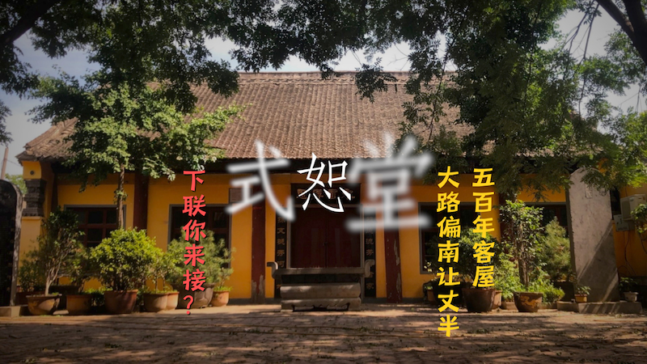

+++
title = "原創詞曲與二胡琴鳴：【式恕堂】音畫合輯"
date = 2026-05-16

[taxonomies]
tags = ["詩歌", "音樂", "視頻", "式恕堂", "古建築", "民居", "歷史", "文物", "訪古", "尋根"]
+++

**記錄短片**｜[嗶哩嗶哩](https://www.bilibili.com/video/BV1pQLg6GEDv/) · [YouTube](https://youtu.be/LSZFnIn4uOE)

**一曲琴鳴**｜[嗶哩嗶哩](https://www.bilibili.com/video/BV1dSjQ6mELm/) · [YouTube](https://youtu.be/MHjI5FFRO7Q)

> 五百年客屋大路偏南讓丈半 \
> 十八世傳人不忘風骨作琴鳴

感謝每一位駐足聆聽、看見這段歷史的朋友。

<!-- more -->

## 題記

五百年傳家客屋，\
自古得堂號式恕。\
經歷了厚重歲月，\
傲立於滄桑故土。

見慣風雨，無懼孤獨，\
老宅背影，安穩肅穆。\
今俺將將譜成一曲，\
琴鳴裏把故事記錄。

明初洪武遷民，\
先祖行至滎澤縣境、\
索須河畔。\
感應風水，\
選址定居，\
開拓出一方村寨。

歷數代耕讀，\
正德年間，\
大啓宏規。\
客屋得名「式恕堂」，\
五百年度盡滄桑。

縱現代都市巨變，\
北四環規劃幹線，\
爲保護這抹古色，\
硬教高架路南繞丈半。

祖宗留下寧折不彎的風骨，\
天地回報一道溫柔的弧線。

丙午暮春，\
尋根老宅，\
化作雅頌。

僅以此曲，\
敬故土，問源流。

十八世　辰　謹記

## 詩作

索須灣處繞堂幽 \
稚子相隨過故丘 \
朱門鎖卻歸鄉路 \
且撫殘碑問源流

正德宏規起畫樓 \
梅巔傲骨萬古留 \
寧折不彎迎斧鉞 \
滿門烈義洗沉羞

昭雪碑成經百劫 \
幾代興衰度春秋 \
化作學宮傳雅頌 \
書聲驚破歲月愁

百年人事皆雲散 \
德承式恕佑無憂 \
大路偏南讓丈半 \
莫忘風骨在心頭

## 創作感言

曲調早有構思，\
可是……\
這題目太宏大，\
某詩才遠不夠，\
竟不知第一筆如何下。

理想中的作品，\
某本以爲今生再無機會完成。\
去年索性挪用，\
給 RIME 輸入法寫了主題曲。\
哪知，但凡肯發力開端，\
總不會一無所獲——\
竟憑電腦上的點選，\
勉力拼湊出了曲譜。\
細節處理雖差得遠，\
好在，敘事線條還不錯。

這次回鄉，如同往年，\
每每多些感觸。\
爭求不負初心，\
雖不能一氣呵成，\
也字字糾結推敲，\
逐音符斟酌比較。

萬幸如今有電腦，\
不厭其煩聽我叨叨。\
天書般的樂理文法，\
他分析得頭頭是道。\
給我遣詞造句的建議，\
一本正經地品鑑，\
給了我「我也會了」的錯覺，\
以及盲目的信念。\
這才得以出奇跡般，\
將詞曲湊全。

可是……\
畢竟業餘，純粹外行，\
電腦相助，只管瞎編。\
專業人的寫作水平，\
絕不能企及；\
理想中的表達效果，\
亦無法實現。

雖不完美，\
也總歸是交出了作品，\
達成了心願。

## 引用資料與歷史文獻

- 鄭州《弓氏家譜》記載：式恕堂家族源流與五百年客屋歷史變遷
- 鄭州《弓氏家譜》第八次續修祝捷錄像
- 丙午年三月初三寶刀傳藏·弓氏祭祖大典實況錄像
- 东方网《寻迹古建文脉 留存乡愁记忆》新聞配圖
- 音樂創作協同：MuseScore 4 / AI 樂理與視聽對位協同微調
